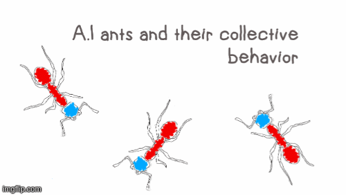
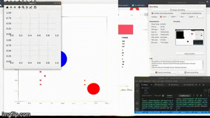
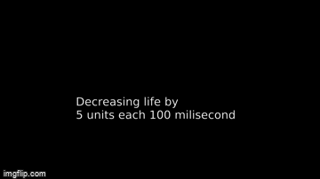
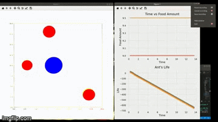
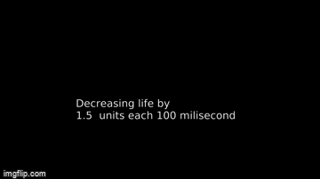

# Ant's movement and their way of searching for food visualized by creating Ant agent and ploting in matplotlib

I created Simple reflex agents to replicate ants and their behavior. The agent smells food and takes the food back to the nest. While returning they drop a chemical trail which lets other ants to sniff and find the food source.

Although simple reflex agent but collectively they act in a very sophisticated manner.

The more ants go to a food source they reinforce the chemical trail.

I used several death rate and life expectency to see their behavior.

It's harder to create a stable trail if the food is distant.

# Simulation

# Data visualization

# Testing different types of death rate

1. Death rate 5 units per 100 milisecond
   

1. Death rate 2 units per 100 milisecond
   

1. Death rate 1.5 units per 100 milisecond
   

1. Death rate 1 units per 100 milisecond
   
